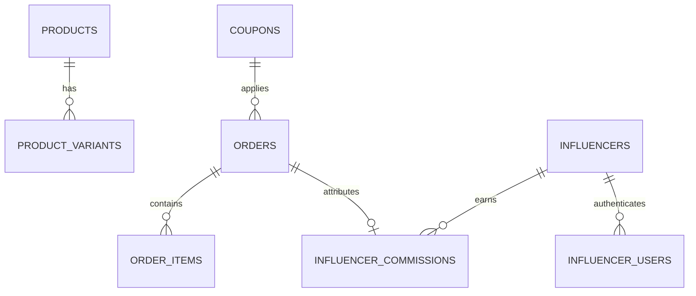

# E-Commerce & Creator Admin Operating System
### Standalone Headless Engine — Architecture & Setup Blueprint
**Author / Creator**: Tanmay (`by-tanmay`)
**Version**: 2.0 (Production Core)

---

## 📌 1. Executive Summary & Purpose

This repository is a **standalone, modular, brand-agnostic E-Commerce Operating System & Creator Affiliate Engine**. It provides a production-grade Admin Command Center, Creator/Influencer Portal, Order Lifecycle Management, Variant Inventory Control, and Market-Standard A4 Commercial Retail Invoicing/Billing engine.

Any AI Agent or Developer can plug this entire architecture into any new e-commerce storefront (React, Vite, Next.js, Vue, Mobile) in **under 5 minutes**.

---

## 🏛️ 2. Core Architectural Principles (The 5 Golden Rules)

To ensure zero regressions when building or extending features, any developer or AI agent modifying this codebase MUST follow these 5 rules:

### Rule 1: Single Source of Truth via Service Layer
- **Never** write direct database SQL queries inside React UI components or buttons.
- All database operations, calculations, and mutations must go through dedicated service modules in `src/services/`:
  - `adminService.js`: Orders, fulfillment, stock adjustments, product CRUD, metrics.
  - `influencerService.js`: Creator referrals, dynamic commission math, payouts tracking.
  - `orderService.js`: Order submission, snapshot freezing, local storage persistence.
  - `paymentService.js`: Razorpay / UPI gateway integration and verification.

### Rule 2: Database Schema is Immutable Law
- In any new Supabase / PostgreSQL database, table names and essential column names must strictly match `supabase/schema.sql`.
- Core tables: `orders`, `products`, `product_variants`, `influencers`, `influencer_commissions`, `coupons`, `email_events`, `influencer_users`, `admin_roles`.

### Rule 3: 1-Click Rebranding via `brandConfig.js`
- All brand identity fields (Brand Name, Legal Atelier Name, Support Email, Website, Registered Address, Currency, Shipping thresholds, Default Commission Rates) are dynamically read from `src/config/brandConfig.js`.
- To rebrand the entire system for a new client or label, edit **only** `src/config/brandConfig.js`.

### Rule 4: Dual-Mode Architecture (Live Cloud + Offline Fallback)
- If Supabase environment keys are provided, the system operates in **Live PostgreSQL Mode** with Row Level Security (RLS).
- If keys are missing or offline, the system automatically falls back to **Simulated Local Mode** with `localStorage` persistence, allowing instant local testing and client demos without database setup.

### Rule 5: Read-Only Invoicing & Immutable Snapshots
- Invoices and packing slips render from the **frozen order item snapshot** created at checkout time.
- Generating, viewing, or printing bills **must never** mutate order totals, product prices, or database inventory.

---

## 🗄️ 3. Database Schema Overview (Supabase / PostgreSQL)

The database schema is defined in `supabase/schema.sql`. Key tables and relationships:



### Table Reference:
1. `products`: Root catalog items (`id`, `name`, `slug`, `price`, `description`, `category`, `is_active`).
2. `product_variants`: Inventory per size/color (`id`, `product_id`, `sku`, `size`, `stock_quantity`, `price_override`, `is_active`).
3. `orders`: Customer orders snapshot (`id`, `order_number`, `customer_name`, `customer_email`, `customer_phone`, `shipping_address`, `items`, `subtotal_amount`, `discount_amount`, `shipping_fee`, `total_amount`, `payment_method`, `payment_status`, `order_status`, `courier_name`, `tracking_number`, `influencer_id`, `influencer_commission_amount`).
4. `influencers`: Creator partners (`id`, `name`, `handle`, `email`, `coupon_code`, `commission_type`, `commission_value`, `is_active`).
5. `influencer_commissions`: Commission audit logs per order (`id`, `influencer_id`, `order_id`, `order_number`, `commission_amount`, `status`, `payout_reference`, `paid_at`).
6. `coupons`: Promotional discount rules (`id`, `code`, `discount_type`, `discount_value`, `min_order_amount`, `is_active`).
7. `admin_roles`: PostgreSQL role-based authorization for admin users (`id`, `user_id`, `role`, `is_active`).

---

## 🚀 4. Step-by-Step Setup Guide (For Any New Website)

### Step 1: Clone or Copy the Core Modules
Copy the following directories into your new frontend project:
- `src/services/`
- `src/context/`
- `src/pages/admin/`
- `src/pages/influencer/`
- `src/pages/auth/`
- `src/components/admin/`
- `src/config/`

### Step 2: Configure Environment Variables
Create `.env` in the root folder using `.env.example`:
```env
VITE_SUPABASE_URL=https://your-project.supabase.co
VITE_SUPABASE_ANON_KEY=your-anon-key
VITE_RAZORPAY_KEY_ID=rzp_test_your_key_id
```

### Step 3: Run Database Schema Script
1. Open your Supabase Project Dashboard $\rightarrow$ **SQL Editor**.
2. Open `supabase/schema.sql` from this repository.
3. Paste and click **Run**.
4. *(Optional)* Paste and run `supabase/seed_demo_data.sql` to populate sample products and demo accounts.

### Step 4: Customize Brand Information
Open `src/config/brandConfig.js` and set your brand details:
```javascript
export const BRAND_CONFIG = {
  brandName: 'YOUR_BRAND',
  legalName: 'Your Brand Private Limited',
  websiteUrl: 'https://www.yourbrand.com',
  supportEmail: 'support@yourbrand.com',
  currencySymbol: '₹',
  freeShippingThreshold: 2000,
  standardShippingFee: 99
};
```

### Step 5: Start Development
```bash
npm install
npm run dev
```

---

## 🔐 5. Authentication & Permissions Model

- **Single Unified Login (`/login`)**:
  - Direct tab switcher: **Creator / Partner** or **Store Admin**.
- **Admin Access**:
  - Super Admins verified via Supabase PostgreSQL RPC `check_is_admin()`.
  - Grants full control over orders, fulfillment tracking, inventory adjustments, and creator payouts.
- **Creator Access**:
  - Authenticates creators using their email and password or assigned account mapping in `influencer_users`.
  - Privacy Safeguard: Customer street addresses, phone numbers, and payment transaction IDs are strictly masked in creator views.

---

## 🖨️ 6. Commercial Invoice & Bill Generator Engine

- **Format**: Standard A4 Commercial Retail Invoice (210mm $\times$ 297mm).
- **Engine**: Isolated hidden iframe print engine (`#loozars_invoice_print_frame`) with complete standalone CSS injection.
- **Features**:
  - Official brand title, registered atelier address, and contact info.
  - Tax invoice & order metadata box with payment confirmation.
  - 2-Column Billed To (Customer) & Shipped To (Delivery) sections.
  - Structured line items table with sizes, SKUs, quantities, and rates.
  - Automatic Indian Rupee currency words conversion (e.g. *"Rupees Three Thousand Two Hundred Only"*).
  - Terms & conditions, declaration, and authorized signatory seal block.
  - Dual action: Direct **Print / Save as PDF** and **Open in New Tab**.

---

## 🧪 7. Verification & Testing Protocol

Before deploying or committing changes, run:
```bash
# 1. Verify build compiles with 0 errors
npm run build

# 2. Key functionality checklist:
# - Place a COD order on storefront -> Appears in /admin Orders tab in real time.
# - Place an order with coupon code -> Creator commission recorded in Creator portal.
# - Open order detail in Admin -> Click [ Print Bill / Invoice ] -> PDF / Print preview opens cleanly.
# - Cancel an order in Admin -> Variant stock automatically restored.
```

---

### Developed with ❤️ by Tanmay (`ecommerce-admin-engine-by-tanmay`)
