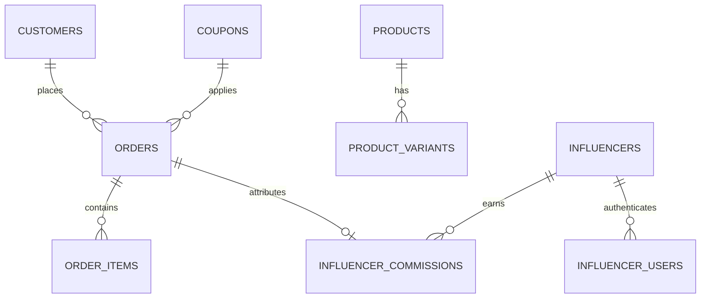

# E-Commerce & Creator Admin Operating System (Atelier Edition)
### Master Architectural Blueprint & Implementation Specification
**Author / Creator**: Tanmay (`by-tanmay`)  
**Design Standard**: Matte Luxury Atelier (SSENSE / Linear Studio Aesthetic)  
**Version**: 2.5 (Production Hardened Core)

---

## 📌 1. Executive Summary & Purpose

This repository provides a **modular, brand-agnostic E-Commerce Operating System, Customer CRM Dossier Suite, and Creator Affiliate Engine**. It delivers:
1. **Atelier Command Center (`/admin`)**: Metric KPI cards, order state machine, variant stock matrix, and thermal slip printing.
2. **Customer CRM & VIP Dossier (`/crm`)**: LTV calculations, automated sizing preference profiling, 1-click WhatsApp concierge outreach, and staff notes.
3. **Creator & Ambassador Portal (`/influencer`)**: Dedicated affiliate login, live referred revenue tracking, and commission settlement ledgers.
4. **Commercial Invoicing Engine**: Isolated iframe A4 tax invoice generator with automatic Indian Rupee currency words conversion.

Any developer or AI agent can integrate this complete architecture into any new e-commerce project in **under 5 minutes**.

---

## 🏛️ 2. Core Architectural Principles (The 6 Golden Rules)

To maintain absolute system stability, all developers and AI agents must follow these 6 non-negotiable rules:

### Rule 1: Single Source of Truth via Service Layer
- **Never** write direct database SQL queries inside React UI components or buttons.
- All database operations, calculations, and mutations must go through dedicated service modules in `src/services/`:
  - `adminService.js`: Orders, fulfillment, stock adjustments, product CRUD, metrics.
  - `crmService.js`: Customer LTV math, sizing affinity derivation, staff notes, and WhatsApp URL generation.
  - `influencerService.js`: Creator referrals, dynamic commission math, payouts tracking.
  - `orderService.js`: Order submission, snapshot freezing, local storage persistence.
  - `paymentService.js`: Razorpay / UPI gateway integration and verification.

### Rule 2: Database Schema is Immutable Law
- In any new Supabase / PostgreSQL database, table names and essential column names must strictly match `supabase/schema.sql`.
- Core tables: `orders`, `products`, `product_variants`, `customers`, `influencers`, `influencer_commissions`, `coupons`, `email_events`, `influencer_users`, `admin_roles`.

### Rule 3: Strict Data Privacy & Zero PII in Repositories
- **Real customer data and API keys must NEVER enter Git.**
- All live customer records live securely in encrypted Supabase PostgreSQL with Row Level Security (RLS).
- Repositories only contain code, blank schemas, and synthetic mock seed files (*John Doe, #LZR-1001*).

### Rule 4: 1-Click Rebranding via `brandConfig.js`
- Brand Name, Legal Atelier Name, Support Email, Website, Registered Address, Currency, Shipping thresholds, and Default Commission Rates are dynamically loaded from `src/config/brandConfig.js`.
- To rebrand the entire studio for a new client or label, edit **only** `src/config/brandConfig.js`.

### Rule 5: Dual-Mode Architecture (Live Cloud + Zero-Config Offline Fallback)
- **Live Mode**: If Supabase environment keys are provided, the system operates in real-time PostgreSQL Mode with RLS.
- **Offline Demo Mode**: If keys are missing, the system automatically runs in simulated local mode with `localStorage` persistence and cross-tab event synchronization, allowing instant client demos without database setup.

### Rule 6: Read-Only Invoicing & Immutable Snapshots
- Invoices and packing slips render from the **frozen order item snapshot** created at checkout time.
- Generating, viewing, or printing bills **must never** mutate order totals, product prices, or database inventory.

---

## 🎨 3. Design System Standards (Matte Luxury Atelier)

The admin suite enforces a strict, distraction-free **Linear / SSENSE luxury studio palette**:

```
┌────────────────────────────────────────────────────────────────────────┐
│                        MATTE ATELIER PALETTE                           │
│  Canvas: #0C0C0F   •   Cards: #141418   •   Borders: #22222C           │
│  Headings: #EDEDF0 •   Muted: #71717A   •   Primary CTA: White/Black   │
└────────────────────────────────────────────────────────────────────────┘
```

1. **Monochrome Dominance**: 90% monochrome interface. Colors are strictly reserved for functional status:
   - **Emerald (`emerald-400`)**: Money collected, orders delivered, in-stock health.
   - **Sky (`sky-400`)**: Active in-flight operations (COD pending, orders processing).
   - **Rose (`rose-400`)**: Critical stockouts, cancellations, destructive actions.
2. **High-Contrast White CTAs**: All primary modal and screen submit buttons use `bg-white hover:bg-zinc-200 text-black font-semibold rounded-xl`.
3. **Calm Micro-Dot Indicators**: Status badges use calm static monospace micro-dots (`● Paid`, `● COD Pending`, `○ Unpaid`) with **zero pulsing animations**.
4. **Micro-Typography**: All table headers use uppercase tracking micro-typography (`text-[10px] font-mono tracking-widest text-zinc-500 uppercase font-normal`).
5. **Zero Emojis**: 100% emoji-free UI across all admin and customer dossier components.

---

## 🗄️ 4. Database Entity Relationships (Supabase / PostgreSQL)



### Table Reference:
1. `customers`: Customer CRM profile (`id`, `name`, `email`, `phone`, `city`, `state`, `is_vip`, `notes`, `tags`).
2. `products`: Catalog pieces (`id`, `name`, `slug`, `base_price`, `sale_price`, `description`, `category`, `drop`, `is_active`, `is_featured`).
3. `product_variants`: Size stock matrix (`id`, `product_id`, `sku`, `size`, `stock_quantity`, `reserved_quantity`, `is_active`).
4. `orders`: Immutable order snapshot (`id`, `order_number`, `customer_name`, `customer_email`, `customer_phone`, `shipping_address`, `items`, `subtotal_amount`, `discount_amount`, `shipping_fee`, `total_amount`, `payment_method`, `payment_status`, `order_status`, `courier_name`, `tracking_number`, `influencer_id`).
5. `influencers`: Creator affiliate partners (`id`, `name`, `instagram_handle`, `email`, `coupon_code`, `customer_discount_value`, `commission_value`, `barter_details`, `is_active`).
6. `influencer_commissions`: Commission settlement ledger (`id`, `influencer_id`, `order_id`, `order_number`, `commission_amount`, `status`, `payout_reference`, `paid_at`).
7. `coupons`: Promo codes (`id`, `code`, `discount_type`, `discount_value`, `min_order_amount`, `max_discount_amount`, `usage_limit`, `expires_at`, `is_active`).
8. `admin_roles`: PostgreSQL role-based authorization for admin users (`id`, `user_id`, `role`, `is_active`).

---

## 🚀 5. 5-Minute Setup Guide (Any New Project)

### Step 1: Copy Core Directories
Copy these folders into your project:
- `src/services/`
- `src/context/`
- `src/pages/admin/`
- `src/pages/influencer/`
- `src/pages/auth/`
- `src/components/admin/`
- `src/config/`

### Step 2: Configure Environment Variables
Create `.env` using `.env.example`:
```env
VITE_SUPABASE_URL=https://your-project.supabase.co
VITE_SUPABASE_ANON_KEY=your-anon-key
VITE_RAZORPAY_KEY_ID=rzp_test_your_key_id
```

### Step 3: Run Database Schema
1. Open Supabase Dashboard $\rightarrow$ **SQL Editor**.
2. Run `supabase/complete_schema_and_seed.sql` to initialize all tables, RLS policies, and stored procedures.

### Step 4: Customize Brand Information
Edit `src/config/brandConfig.js`:
```javascript
export const BRAND_CONFIG = {
  brandName: 'YOUR_BRAND',
  legalName: 'Your Brand Private Limited',
  websiteUrl: 'https://www.yourbrand.com',
  supportEmail: 'support@yourbrand.com',
  currencySymbol: '₹',
  freeShippingThreshold: 2000,
  standardShippingFee: 99
};
```

### Step 5: Start Studio
```bash
npm install
npm run dev
```

---

## 🧪 6. Verification & Quality Assurance Protocol

Before deploying or committing changes, verify:
```bash
# 1. Verify build compiles with 0 errors
npm run build

# 2. Key functionality checklist:
# - Place an order on storefront -> Appears in /admin Orders in real time.
# - Apply creator coupon -> Commission recorded in /influencer dashboard.
# - Open customer in CRM -> Automatic sizing preference & WhatsApp link generated.
# - Open order in Admin -> Print thermal packing slip & A4 retail invoice.
# - Adjust variant stock -> Audit reason logged in inventory logs.
```

---

### Developed with ❤️ by Tanmay (`by-tanmay`)

