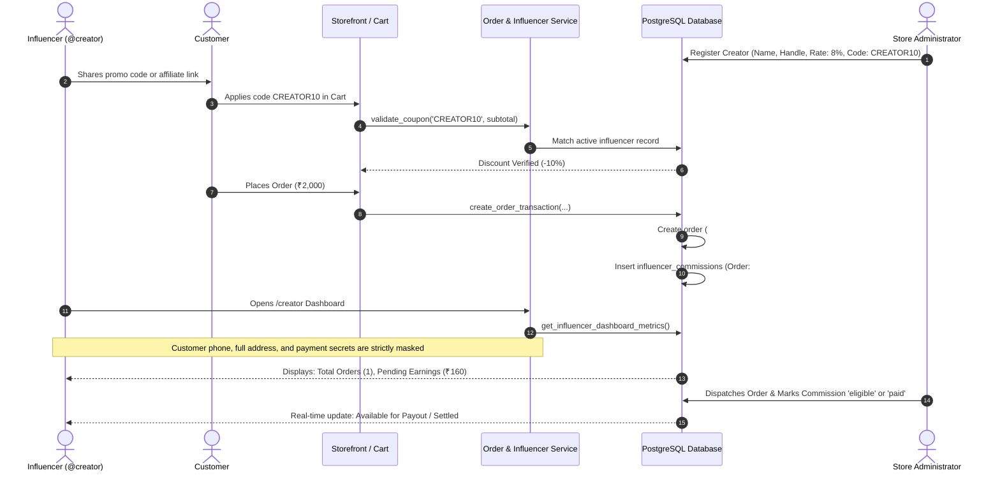
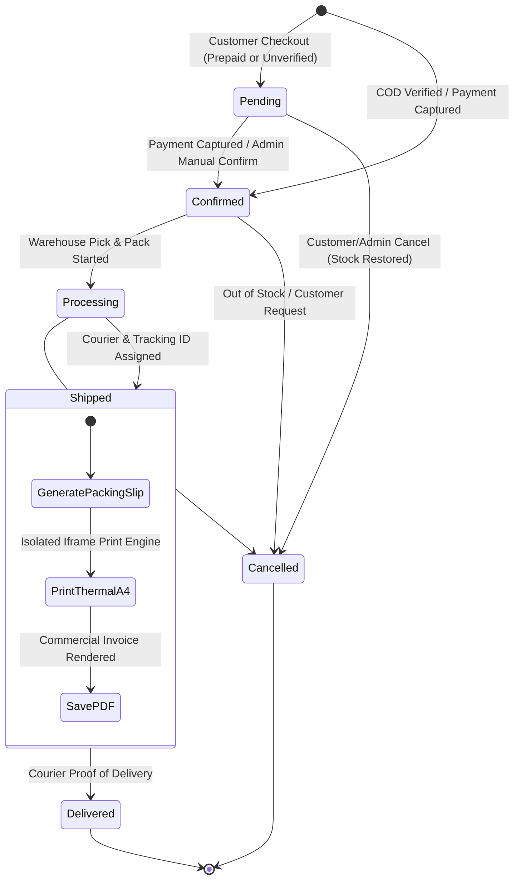
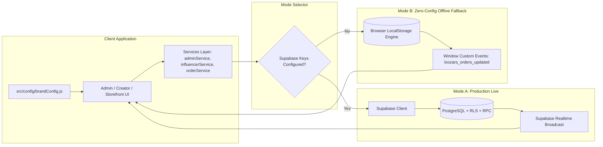
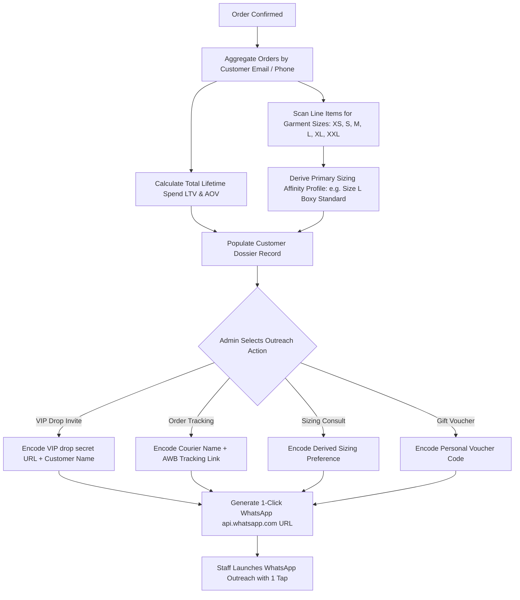
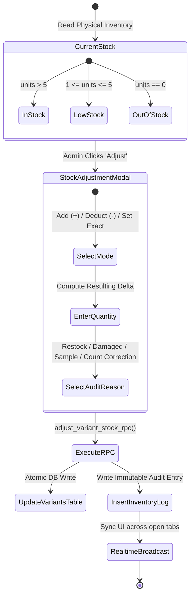

# System Workflows & Data Lifecycles
### E-Commerce Operating System & Creator Affiliate Engine
**Author / Creator**: Tanmay (`ecommerce-admin-engine-by-tanmay`)

---

## 1. 🛒 Customer Order & Inventory Lifecycle

This diagram illustrates what occurs from the moment a shopper clicks "Place Order" through database verification, deterministic inventory locking, and order fulfillment.

```mermaid
flowchart TD
    A[Customer Adds Items to Cart] --> B[Enter Shipping Details & Optional Coupon Code]
    B --> C{Payment Method Chosen}
    
    C -->|COD (Cash on Delivery)| D[Call create_order_transaction RPC]
    C -->|Online (UPI / Cards / NetBanking)| E[Initialize Gateway Session / Razorpay]
    
    E --> F[Customer Completes Payment]
    F --> G[Verify HMAC Signature on Server]
    G --> D
    
    D --> H[PostgreSQL FOR UPDATE Lock on Variants]
    H --> I{Stock Quantity >= Requested?}
    
    I -->|No| J[Rollback Transaction & Alert User 'Sold Out']
    I -->|Yes| K[Atomic Stock Decrement: stock - qty]
    
    K --> L[Generate Immutable Order Snapshot]
    L --> M[Record in orders Table]
    M --> N[Log Delta in inventory_logs Audit Table]
    
    N --> O{Was Coupon / Creator Code Applied?}
    O -->|Yes| P[Insert Row in influencer_commissions Table]
    O -->|No| Q[Emit Order Confirmed Event]
    P --> Q
    
    Q --> R[Admin Real-Time Sync & Thermal Bill Ready]
```

---

## 2. 🤝 Creator / Affiliate Attribution & Settlement Loop

This diagram maps how influencer links and discount codes generate trackable commissions with complete privacy preservation.



---

## 3. 📦 Admin Fulfillment & Commercial Invoicing Lifecycle

The state machine governing order status progression and official A4 invoice printing.



---

## 4. ⚡ Dual-Mode Architecture (Live Cloud vs Local Mode)

How the system transparently functions in production with Supabase and in local/demo environments without setup.



---

## 5. 👤 Customer CRM & Sizing Affinity Derivation Lifecycle

How the CRM calculates customer lifetime spend, sizing preference, and generates 1-click WhatsApp concierge links.



---

## 6. 📈 Studio Inventory Delta & Reason Auditing State Machine

How every stock adjustment is audited without silent decrements.



---

### Developed with ❤️ by Tanmay (`by-tanmay`)
