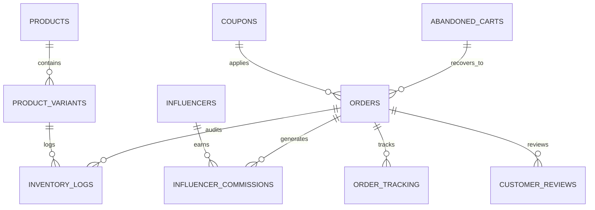

# LOOZARS® — GOLDEN DATASET SPECIFICATION (PHASE 1)
**Document Version:** `1.0.0-PROD-SPEC`  
**Execution Phase:** `PHASE 1 — PREPARATION ONLY` (Zero transactional mutations executed)  
**Target Catalog Authority:** `4 Master Products`, `21 Active SKUs`, `467 Total Starting Units`  
**Catalog Base Price:** `₹899` (Strictly Unchanged)  
**Synthetic Target:** `100 Customers (CUSTOMER-001 to CUSTOMER-100)` | `220 Deterministic Orders`  

---

## 1. Executive Test Architecture & Objectives

The purpose of this Golden Dataset is to provide a deterministic, mathematically verifiable benchmark for every business logic engine, calculation path, state transition, inventory reconciliation, and analytics metric within the LOOZARS® Admin Portal and Supabase PostgreSQL backend.

### Strict Test Invariants:
1. **Catalog & Pricing:** No modification to product names, SKUs, base prices (₹899), or variant definitions.
2. **Coupons:** No modification to existing coupon rules or database schema.
3. **Inventory Integrity:** Every SKU unit deduction and restoration is strictly bounded; ending stock remains strictly non-negative ($\ge 0$).
4. **Isolated Preparation:** Phase 1 defines the complete specification without altering current production or live customer records.

---

## 2. Authoritative Catalog & Inventory Starting Baseline

| Master Product | Product ID | Base SKU | Price | Variants (SKUs) | Starting Stock |
| :--- | :--- | :--- | :---: | :--- | :---: |
| **LZR VELO 07** | `00000000-0000-0000-0000-000000000001` | `LZR-D01-01` | ₹899 | XS(76), S(15), M(13), L(34), XL(15), XXL(101) | **254** |
| **LZR RACING DIVISION** | `00000000-0000-0000-0000-000000000002` | `LZR-D01-02` | ₹899 | S(15), M(15), L(11), XL(9), XXL(15) | **65** |
| **LZR APEX CLUB** | `00000000-0000-0000-0000-000000000003` | `LZR-D01-03` | ₹899 | XS(15), S(15), M(15), L(12), XL(15) | **72** |
| **LZR OCEAN SPEEDWAY** | `00000000-0000-0000-0000-000000000004` | `LZR-D01-04` | ₹899 | S(15), M(15), L(16), XL(15), XXL(15) | **76** |
| **TOTALS** | **4 Master Silhouettes** | | | **21 Active SKUs** | **467 Units** |

---

## 3. Active Promotional Coupons & Influencer Affiliates

### A. Active Database Coupons
| Code | Type | Value | Min Order | Usage Limit | Associated Partner |
| :--- | :--- | :--- | :---: | :---: | :--- |
| `WELCOME10` | Percentage | 10% | ₹800 | Unlimited | Direct Store / First Drop |
| `FLASH20` | Fixed | ₹200 | ₹1,798 | Unlimited | Direct Store Flash Promo |
| `RARE15` | Percentage | 15% | ₹1,500 | Unlimited | Direct Store Exclusive |
| `KHAN10` | Percentage | 10% | ₹800 | Unlimited | Yuuf Khan (`khan`) |
| `AARYAN10` | Percentage | 10% | ₹800 | Unlimited | Aaryan Sharma (`aaryan_street`) |
| `ZARA15` | Percentage | 15% | ₹800 | Unlimited | Zara Mehra (`zaramehra_`) |
| `ROHAN10` | Percentage | 10% | ₹800 | Unlimited | Rohan Varma (`rohan_speed`) |
| `RHEA10` | Percentage | 10% | ₹800 | Unlimited | Rhea Kapoor (`rhea_fits`) |
| `VIP20` | Percentage | 20% | ₹2,500 | Unlimited | VIP Collectors |

### B. Active Influencer Registry
| Influencer ID | Creator Name | Handle | Coupon | Commission Rate | Type |
| :--- | :--- | :--- | :--- | :---: | :--- |
| `de2ec333-3a19-464a-8efa-922ec3819eed` | Yuuf Khan | `khan` | `KHAN10` | 8% | Barter Collab |
| `a1111111-2222-3333-4444-555555555555` | Aaryan Sharma | `aaryan_street` | `AARYAN10` | 8% | Paid Partner |
| `b2222222-3333-4444-5555-666666666666` | Zara Mehra | `zaramehra_` | `ZARA15` | 5% | Barter Collab |
| `c3333333-4444-5555-6666-777777777777` | Rohan Varma | `rohan_speed` | `ROHAN10` | 8% | Paid Partner |
| `d4444444-5555-6666-7777-888888888888` | Rhea Kapoor | `rhea_fits` | `RHEA10` | 10% | Paid Partner |

---

## 4. Scenario Coverage Matrix (35 Required Scenarios)

| Scenario # | Scenario Description | Assigned Customer(s) | Target Order(s) / Test Case |
| :---: | :--- | :--- | :--- |
| **01** | One prepaid order | `CUSTOMER-001`, `CUSTOMER-002` | `LZR-2001`, `LZR-2002` |
| **02** | Multiple prepaid orders | `CUSTOMER-003`, `CUSTOMER-004` | `LZR-2003`, `LZR-2004`, `LZR-2005`, `LZR-2006` |
| **03** | COD order | `CUSTOMER-005`, `CUSTOMER-006` | `LZR-2007`, `LZR-2008` |
| **04** | Multiple COD orders | `CUSTOMER-007`, `CUSTOMER-008` | `LZR-2009`, `LZR-2010`, `LZR-2011`, `LZR-2012` |
| **05** | Cancelled order | `CUSTOMER-009`, `CUSTOMER-010` | `LZR-2013`, `LZR-2014` |
| **06** | Delivered order | `CUSTOMER-011`, `CUSTOMER-012` | `LZR-2015`, `LZR-2016` |
| **07** | Processing order | `CUSTOMER-013`, `CUSTOMER-014` | `LZR-2017`, `LZR-2018` |
| **08** | Shipped order | `CUSTOMER-015`, `CUSTOMER-016` | `LZR-2019`, `LZR-2020` |
| **09** | Failed payment | `CUSTOMER-017`, `CUSTOMER-018` | `LZR-2021`, `LZR-2022` |
| **10** | Payment retry (Failed $\rightarrow$ Successful Paid) | `CUSTOMER-019`, `CUSTOMER-020` | `LZR-2023`, `LZR-2024` |
| **11** | Coupon usage (`WELCOME10`, `FLASH20`, `RARE15`) | `CUSTOMER-021`, `CUSTOMER-022`, `CUSTOMER-023` | `LZR-2025`, `LZR-2026`, `LZR-2027` |
| **12** | Expired coupon attempt | `CUSTOMER-024` | `LZR-2028` (Validation check `EXPIRED50`) |
| **13** | Minimum-order coupon failure (< ₹1500 on `RARE15`) | `CUSTOMER-025` | `LZR-2029` (Subtotal ₹899 < ₹1500 threshold) |
| **14** | Maximum-discount coupon (`VIP20` on bulk cart) | `CUSTOMER-026` | `LZR-2030` (Cart > ₹5,000 with 20% discount) |
| **15** | Product return (Single item return request) | `CUSTOMER-027` | `LZR-2031` (Item returned, status `returned`) |
| **16** | Full order return | `CUSTOMER-028` | `LZR-2032` (All items returned, payment refunded) |
| **17** | Partial return (1 of 2 items returned) | `CUSTOMER-029` | `LZR-2033` (Partial item credit & restock) |
| **18** | Refund (Delivered online order refunded) | `CUSTOMER-030` | `LZR-2034` (Refund processed via Gateway) |
| **19** | Multiple refunds where valid | `CUSTOMER-031` | `LZR-2035`, `LZR-2036` (2 distinct refunded orders) |
| **20** | Abandoned cart (No order created) | `CUSTOMER-032`, `CUSTOMER-033` | `CART-2001`, `CART-2002` (Unrecovered) |
| **21** | Abandoned cart $\rightarrow$ Recovered order | `CUSTOMER-034`, `CUSTOMER-035` | `CART-2003` $\rightarrow$ `LZR-2037`, `CART-2004` $\rightarrow$ `LZR-2038` |
| **22** | Influencer-attributed order (`AARYAN10`, `KHAN10`) | `CUSTOMER-036`, `CUSTOMER-037` | `LZR-2039`, `LZR-2040` |
| **23** | Multiple influencer orders (Different creators) | `CUSTOMER-038`, `CUSTOMER-039` | `LZR-2041`, `LZR-2042`, `LZR-2043` |
| **24** | Review after delivered order (Verified Buyer) | `CUSTOMER-040`, `CUSTOMER-041` | `LZR-2044` (Delivered) $\rightarrow$ `REV-2001` (5★ Verified) |
| **25** | Review attempt before eligibility (Pending/Cancelled) | `CUSTOMER-042`, `CUSTOMER-043` | `LZR-2045` (Pending) $\rightarrow$ Review rejected |
| **26** | Multiple products in one order (3 distinct SKUs) | `CUSTOMER-044`, `CUSTOMER-045` | `LZR-2046` (VELO 07 + RACING + APEX) |
| **27** | Multiple quantities (3 units of same SKU) | `CUSTOMER-046`, `CUSTOMER-047` | `LZR-2047` (3x `LZR-D01-01-L`) |
| **28** | Multiple sizes in single order | `CUSTOMER-048`, `CUSTOMER-049` | `LZR-2048` (Size M + Size XL) |
| **29** | Same product with different sizes | `CUSTOMER-050`, `CUSTOMER-051` | `LZR-2049` (VELO 07 Size S + VELO 07 Size L) |
| **30** | Cancelled order with inventory restoration | `CUSTOMER-052`, `CUSTOMER-053` | `LZR-2050` (Stock deducted $\rightarrow$ restored on cancel) |
| **31** | Returned item with inventory restoration | `CUSTOMER-054`, `CUSTOMER-055` | `LZR-2051` (Stock restored upon return receipt) |
| **32** | Product price integrity (Audit immutability snapshot) | `CUSTOMER-056` | `LZR-2052` (Snapshot ₹899 remains immutable) |
| **33** | Customer with many orders (VIP / High frequency) | `CUSTOMER-057`, `CUSTOMER-058` | 5+ orders each (`LZR-2053` to `LZR-2064`) |
| **34** | Customer with no completed order (Abandoned/Cancelled) | `CUSTOMER-059`, `CUSTOMER-060` | Only failed/cancelled attempts, spend = ₹0 |
| **35** | Customer with both COD and prepaid history | `CUSTOMER-061`, `CUSTOMER-062` | Prepaid `LZR-2065` + COD `LZR-2066` |

*Note: Customers 063 through 100 populate cross-behavioral real-world distributions spanning Drops 01-03 timeline (7D, 30D, 90D).*

---

## 5. 100 Synthetic Customers Specification (`CUSTOMER-001` to `CUSTOMER-100`)

| Customer ID | Synthetic Name | Synthetic Email | Synthetic Phone | City | State | Pincode | Assigned Scenario / Role |
| :--- | :--- | :--- | :--- | :--- | :--- | :---: | :--- |
| `CUSTOMER-001` | Aarav Kapoor | `aarav.k001@loozars-test.internal` | `+919000000001` | Mumbai | Maharashtra | 400050 | Single Prepaid Order |
| `CUSTOMER-002` | Diya Sen | `diya.s002@loozars-test.internal` | `+919000000002` | Kolkata | West Bengal | 700019 | Single Prepaid Order |
| `CUSTOMER-003` | Siddharth Rao | `sid.r003@loozars-test.internal` | `+919000000003` | Bengaluru | Karnataka | 560038 | Multi-Prepaid Collector |
| `CUSTOMER-004` | Ananya Birla | `ananya.b004@loozars-test.internal` | `+919000000004` | New Delhi | Delhi | 110001 | Multi-Prepaid Collector |
| `CUSTOMER-005` | Vikramaditya Singhania | `vikram.s005@loozars-test.internal` | `+919000000005` | Jaipur | Rajasthan | 302001 | Single COD Order |
| `CUSTOMER-006` | Rhea Pillai | `rhea.p006@loozars-test.internal` | `+919000000006` | Chennai | Tamil Nadu | 600004 | Single COD Order |
| `CUSTOMER-007` | Kabir Malhotra | `kabir.m007@loozars-test.internal` | `+919000000007` | Chandigarh | Punjab | 160017 | Multi-COD Collector |
| `CUSTOMER-008` | Tanya Choudhury | `tanya.c008@loozars-test.internal` | `+919000000008` | Pune | Maharashtra | 411004 | Multi-COD Collector |
| `CUSTOMER-009` | Rohan Joshi | `rohan.j009@loozars-test.internal` | `+919000000009` | Ahmedabad | Gujarat | 380009 | Cancelled Order Test |
| `CUSTOMER-010` | Shreya Deshpande | `shreya.d010@loozars-test.internal` | `+919000000010` | Nagpur | Maharashtra | 440010 | Cancelled Order Test |
| `CUSTOMER-011` | Advait Nair | `advait.n011@loozars-test.internal` | `+919000000011` | Kochi | Kerala | 682016 | Standard Delivered |
| `CUSTOMER-012` | Mira Varma | `mira.v012@loozars-test.internal` | `+919000000012` | Hyderabad | Telangana | 500034 | Standard Delivered |
| `CUSTOMER-013` | Yashwardhan Mehta | `yash.m013@loozars-test.internal` | `+919000000013` | Surat | Gujarat | 395007 | Processing State Pipeline |
| `CUSTOMER-014` | Ishani Dutta | `ishani.d014@loozars-test.internal` | `+919000000014` | Guwahati | Assam | 781005 | Processing State Pipeline |
| `CUSTOMER-015` | Devendra Rathore | `dev.r015@loozars-test.internal` | `+919000000015` | Udaipur | Rajasthan | 313001 | Shipped with Tracking |
| `CUSTOMER-016` | Kriti Sanon | `kriti.s016@loozars-test.internal` | `+919000000016` | Lucknow | Uttar Pradesh | 226001 | Shipped with Tracking |
| `CUSTOMER-017` | Pranav Saxena | `pranav.s017@loozars-test.internal` | `+919000000017` | Kanpur | Uttar Pradesh | 208001 | Failed Payment Drop |
| `CUSTOMER-018` | Natasha Kulkarni | `natasha.k018@loozars-test.internal` | `+919000000018` | Indore | Madhya Pradesh | 452001 | Gateway Failure Test |
| `CUSTOMER-019` | Arjun Talwar | `arjun.t019@loozars-test.internal` | `+919000000019` | Ludhiana | Punjab | 141001 | Payment Retry Scenario |
| `CUSTOMER-020` | Sanjana Menon | `sanjana.m020@loozars-test.internal` | `+919000000020` | Thiruvananthapuram | Kerala | 695001 | Payment Retry Scenario |
| `CUSTOMER-021` | Neil Roy | `neil.r021@loozars-test.internal` | `+919000000021` | Bhubaneswar | Odisha | 751001 | Coupon: `WELCOME10` |
| `CUSTOMER-022` | Zoya Merchant | `zoya.m022@loozars-test.internal` | `+919000000022` | Mumbai | Maharashtra | 400053 | Coupon: `FLASH20` |
| `CUSTOMER-023` | Farhan Qureshi | `farhan.q023@loozars-test.internal` | `+919000000023` | Bhopal | Madhya Pradesh | 462001 | Coupon: `RARE15` |
| `CUSTOMER-024` | Trisha Sengupta | `trisha.s024@loozars-test.internal` | `+919000000024` | Kolkata | West Bengal | 700029 | Expired Coupon Attempt |
| `CUSTOMER-025` | Varun Grover | `varun.g025@loozars-test.internal` | `+919000000025` | Gurgaon | Haryana | 122002 | Min-Order Coupon Failure |
| `CUSTOMER-026` | Simran Kaur | `simran.k026@loozars-test.internal` | `+919000000026` | Amritsar | Punjab | 143001 | VIP Max-Discount (`VIP20`) |
| `CUSTOMER-027` | Aditya Banerjee | `aditya.b027@loozars-test.internal` | `+919000000027` | Patna | Bihar | 800001 | Single Item Return |
| `CUSTOMER-028` | Meera Nambiar | `meera.n028@loozars-test.internal` | `+919000000028` | Kozhikode | Kerala | 673001 | Full Order Return & Refund |
| `CUSTOMER-029` | Sameer Alvi | `sameer.a029@loozars-test.internal` | `+919000000029` | Agra | Uttar Pradesh | 282001 | Partial Return (1 of 2) |
| `CUSTOMER-030` | Tara Sutaria | `tara.s030@loozars-test.internal` | `+919000000030` | Dehradun | Uttarakhand | 248001 | Direct Payment Refund |
| `CUSTOMER-031` | Nikhil Kamath | `nikhil.k031@loozars-test.internal` | `+919000000031` | Bengaluru | Karnataka | 560001 | Multiple Refunded Orders |
| `CUSTOMER-032` | Ananya Seth | `ananya.s032@loozars-test.internal` | `+919000000032` | Varanasi | Uttar Pradesh | 221001 | Abandoned Cart (No Order) |
| `CUSTOMER-033` | Raghav Bahl | `raghav.b033@loozars-test.internal` | `+919000000033` | Noida | Uttar Pradesh | 201301 | Abandoned Cart (No Order) |
| `CUSTOMER-034` | Bhavna Somani | `bhavna.s034@loozars-test.internal` | `+919000000034` | Vadodara | Gujarat | 390001 | Recovered Cart $\rightarrow$ Order |
| `CUSTOMER-035` | Chirag Patel | `chirag.p035@loozars-test.internal` | `+919000000035` | Rajkot | Gujarat | 360001 | Recovered Cart $\rightarrow$ Order |
| `CUSTOMER-036` | Dhruv Sehgal | `dhruv.s036@loozars-test.internal` | `+919000000036` | New Delhi | Delhi | 110024 | Influencer: Aaryan Sharma |
| `CUSTOMER-037` | Mallika Dua | `mallika.d037@loozars-test.internal` | `+919000000037` | Faridabad | Haryana | 121001 | Influencer: Yuuf Khan |
| `CUSTOMER-038` | Sahil Khattar | `sahil.k038@loozars-test.internal` | `+919000000038` | Mumbai | Maharashtra | 400076 | Multi-Influencer Buyer |
| `CUSTOMER-039` | Pooja Dhingra | `pooja.d039@loozars-test.internal` | `+919000000039` | Panaji | Goa | 403001 | Multi-Influencer Buyer |
| `CUSTOMER-040` | Ranveer Allahabadia | `ranveer.a040@loozars-test.internal` | `+919000000040` | Navi Mumbai | Maharashtra | 400703 | Verified Reviewer (5★) |
| `CUSTOMER-041` | Barkha Singh | `barkha.s041@loozars-test.internal` | `+919000000041` | Thane | Maharashtra | 400601 | Verified Reviewer (4★) |
| `CUSTOMER-042` | Kusha Kapila | `kusha.k042@loozars-test.internal` | `+919000000042` | New Delhi | Delhi | 110048 | Review Attempt (Pending) |
| `CUSTOMER-043` | Dolly Singh | `dolly.s043@loozars-test.internal` | `+919000000043` | Nainital | Uttarakhand | 263001 | Review Attempt (Cancelled) |
| `CUSTOMER-044` | Bhuvan Bam | `bhuvan.b044@loozars-test.internal` | `+919000000044` | New Delhi | Delhi | 110019 | Multi-Product Cart |
| `CUSTOMER-045` | Prajakta Koli | `prajakta.k045@loozars-test.internal` | `+919000000045` | Mumbai | Maharashtra | 400080 | Multi-Product Cart |
| `CUSTOMER-046` | Ashish Chanchlani | `ashish.c046@loozars-test.internal` | `+919000000046` | Ulhasnagar | Maharashtra | 421001 | Multi-Quantity Single SKU |
| `CUSTOMER-047` | Carry Minati | `ajey.n047@loozars-test.internal` | `+919000000047` | Faridabad | Haryana | 121002 | Multi-Quantity Single SKU |
| `CUSTOMER-048` | Tanmay Bhat | `tanmay.b048@loozars-test.internal` | `+919000000048` | Bengaluru | Karnataka | 560078 | Multi-Size Order (M + XL) |
| `CUSTOMER-049` | Samay Raina | `samay.r049@loozars-test.internal` | `+919000000049` | Jammu | Jammu & Kashmir | 180001 | Multi-Size Order (S + L) |
| `CUSTOMER-050` | Zakir Khan | `zakir.k050@loozars-test.internal` | `+919000000050` | Indore | Madhya Pradesh | 452002 | Same Silhouette Different Sizes |
| `CUSTOMER-051` | Abhishek Upmanyu | `abhishek.u051@loozars-test.internal` | `+919000000051` | New Delhi | Delhi | 110016 | Same Silhouette Different Sizes |
| `CUSTOMER-052` | Anubhav Bassi | `anubhav.b052@loozars-test.internal` | `+919000000052` | Meerut | Uttar Pradesh | 250001 | Cancelled Stock Restoration |
| `CUSTOMER-053` | Vipul Goyal | `vipul.g053@loozars-test.internal` | `+919000000053` | Kota | Rajasthan | 324005 | Cancelled Stock Restoration |
| `CUSTOMER-054` | Rahul Subramanian | `rahul.s054@loozars-test.internal` | `+919000000054` | Chennai | Tamil Nadu | 600028 | Return Stock Restoration |
| `CUSTOMER-055` | Kanan Gill | `kanan.g055@loozars-test.internal` | `+919000000055` | Bengaluru | Karnataka | 560025 | Return Stock Restoration |
| `CUSTOMER-056` | Kenny Sebastian | `kenny.s056@loozars-test.internal` | `+919000000056` | Bengaluru | Karnataka | 560034 | Pricing Snapshot Integrity |
| `CUSTOMER-057` | Biswa Kalyan | `biswa.k057@loozars-test.internal` | `+919000000057` | Cuttack | Odisha | 753001 | High Spender / VIP 5+ Orders |
| `CUSTOMER-058` | Vir Das | `vir.d058@loozars-test.internal` | `+919000000058` | Dehradun | Uttarakhand | 248003 | High Spender / VIP 5+ Orders |
| `CUSTOMER-059` | Kunal Kamra | `kunal.k059@loozars-test.internal` | `+919000000059` | Mumbai | Maharashtra | 400016 | Zero Completed Orders |
| `CUSTOMER-060` | Munawar Faruqui | `munawar.f060@loozars-test.internal` | `+919000000060` | Dongri | Maharashtra | 400009 | Zero Completed Orders |
| `CUSTOMER-061` | Harsh Gujral | `harsh.g061@loozars-test.internal` | `+919000000061` | Kanpur | Uttar Pradesh | 208002 | Mixed Payment COD & Online |
| `CUSTOMER-062` | Gaurav Kapoor | `gaurav.k062@loozars-test.internal` | `+919000000062` | New Delhi | Delhi | 110092 | Mixed Payment COD & Online |
| `CUSTOMER-063` | Srishti Dixit | `srishti.d063@loozars-test.internal` | `+919000000063` | Noida | Uttar Pradesh | 201303 | General Drop 01 Buyer |
| `CUSTOMER-064` | Mithila Palkar | `mithila.p064@loozars-test.internal` | `+919000000064` | Mumbai | Maharashtra | 400028 | General Drop 01 Buyer |
| `CUSTOMER-065` | Dhruv Rathee | `dhruv.r065@loozars-test.internal` | `+919000000065` | Rohtak | Haryana | 124001 | General Drop 01 Buyer |
| `CUSTOMER-066` | Sandeep Maheshwari | `sandeep.m066@loozars-test.internal` | `+919000000066` | New Delhi | Delhi | 110034 | General Drop 01 Buyer |
| `CUSTOMER-067` | Vivek Bindra | `vivek.b067@loozars-test.internal` | `+919000000067` | New Delhi | Delhi | 110020 | General Drop 01 Buyer |
| `CUSTOMER-068` | Shlok Srivastava | `shlok.s068@loozars-test.internal` | `+919000000068` | New Delhi | Delhi | 110065 | General Drop 01 Buyer |
| `CUSTOMER-069` | Gaurav Taneja | `gaurav.t069@loozars-test.internal` | `+919000000069` | New Delhi | Delhi | 110070 | General Drop 01 Buyer |
| `CUSTOMER-070` | Technical Guruji | `gaurav.c070@loozars-test.internal` | `+919000000070` | Ajmer | Rajasthan | 305001 | General Drop 01 Buyer |
| `CUSTOMER-071` | Niharika NM | `niharika.n071@loozars-test.internal` | `+919000000071` | Bengaluru | Karnataka | 560041 | General Drop 01 Buyer |
| `CUSTOMER-072` | Mostly Sane | `prajakta.k072@loozars-test.internal` | `+919000000072` | Thane | Maharashtra | 400602 | General Drop 01 Buyer |
| `CUSTOMER-073` | Saloni Gaur | `saloni.g073@loozars-test.internal` | `+919000000073` | Bulandshahr | Uttar Pradesh | 203001 | General Drop 01 Buyer |
| `CUSTOMER-074` | Dolly Chaiwala | `sunil.p074@loozars-test.internal` | `+919000000074` | Nagpur | Maharashtra | 440001 | General Drop 01 Buyer |
| `CUSTOMER-075` | Orry Awatramani | `orry.a075@loozars-test.internal` | `+919000000075` | Mumbai | Maharashtra | 400026 | General Drop 01 Buyer |
| `CUSTOMER-076` | Uorfi Javed | `uorfi.j076@loozars-test.internal` | `+919000000076` | Lucknow | Uttar Pradesh | 226010 | General Drop 01 Buyer |
| `CUSTOMER-077` | Munawar Khan | `munawar.k077@loozars-test.internal` | `+919000000077` | Junagadh | Gujarat | 362001 | General Drop 01 Buyer |
| `CUSTOMER-078` | Elvish Yadav | `elvish.y078@loozars-test.internal` | `+919000000078` | Gurgaon | Haryana | 122001 | General Drop 01 Buyer |
| `CUSTOMER-079` | Fukra Insaan | `abhishek.m079@loozars-test.internal` | `+919000000079` | New Delhi | Delhi | 110009 | General Drop 01 Buyer |
| `CUSTOMER-080` | Triggered Insaan | `nischay.m080@loozars-test.internal` | `+919000000080` | New Delhi | Delhi | 110085 | General Drop 01 Buyer |
| `CUSTOMER-081` | Payal Gaming | `payal.d081@loozars-test.internal` | `+919000000081` | Bhilai | Chhattisgarh | 490001 | General Drop 01 Buyer |
| `CUSTOMER-082` | Mortal Sandeep | `naman.m082@loozars-test.internal` | `+919000000082` | Mumbai | Maharashtra | 400069 | General Drop 01 Buyer |
| `CUSTOMER-083` | Scout Tanmay | `tanmay.s083@loozars-test.internal` | `+919000000083` | Valsad | Gujarat | 396001 | General Drop 01 Buyer |
| `CUSTOMER-084` | Jonathan Jude | `jonathan.a084@loozars-test.internal` | `+919000000084` | Goa | Goa | 403516 | General Drop 01 Buyer |
| `CUSTOMER-085` | Dynamo Gaming | `aaditya.s085@loozars-test.internal` | `+919000000085` | Mumbai | Maharashtra | 400093 | General Drop 01 Buyer |
| `CUSTOMER-086` | Kronten Gaming | `chetan.c086@loozars-test.internal` | `+919000000086` | Pune | Maharashtra | 411038 | General Drop 01 Buyer |
| `CUSTOMER-087` | Snax Gaming | `raj.v087@loozars-test.internal` | `+919000000087` | Hyderabad | Telangana | 500081 | General Drop 01 Buyer |
| `CUSTOMER-088` | Mavi Harmandeep | `harmandeep.m088@loozars-test.internal` | `+919000000088` | Jalandhar | Punjab | 144001 | General Drop 01 Buyer |
| `CUSTOMER-089` | Regaltos Gaming | `shubham.t089@loozars-test.internal` | `+919000000089` | New Delhi | Delhi | 110058 | General Drop 01 Buyer |
| `CUSTOMER-090` | Viper Gaming | `yash.s090@loozars-test.internal` | `+919000000090` | Mumbai | Maharashtra | 400077 | General Drop 01 Buyer |
| `CUSTOMER-091` | Aman Dhattarwal | `aman.d091@loozars-test.internal` | `+919000000091` | New Delhi | Delhi | 110078 | General Drop 01 Buyer |
| `CUSTOMER-092` | Alakh Pandey | `alakh.p092@loozars-test.internal` | `+919000000092` | Prayagraj | Uttar Pradesh | 211001 | General Drop 01 Buyer |
| `CUSTOMER-093` | Shradha Khapra | `shradha.k093@loozars-test.internal` | `+919000000093` | Roorkee | Uttarakhand | 247667 | General Drop 01 Buyer |
| `CUSTOMER-094` | Love Babbar | `love.b094@loozars-test.internal` | `+919000000094` | New Delhi | Delhi | 110091 | General Drop 01 Buyer |
| `CUSTOMER-095` | Striver Raj | `takeuforward095@loozars-test.internal` | `+919000000095` | Kolkata | West Bengal | 700064 | General Drop 01 Buyer |
| `CUSTOMER-096` | Kunal Kushwaha | `kunal.k096@loozars-test.internal` | `+919000000096` | Sonipat | Haryana | 131001 | General Drop 01 Buyer |
| `CUSTOMER-097` | Hitesh Choudhary | `hitesh.c097@loozars-test.internal` | `+919000000097` | Jaipur | Rajasthan | 302020 | General Drop 01 Buyer |
| `CUSTOMER-098` | Piyush Garg | `piyush.g098@loozars-test.internal` | `+919000000098` | Chandigarh | Punjab | 160022 | General Drop 01 Buyer |
| `CUSTOMER-099` | Harkirat Singh | `harkirat.s099@loozars-test.internal` | `+919000000099` | Gurgaon | Haryana | 122018 | General Drop 01 Buyer |
| `CUSTOMER-100` | Tanay Pratap | `tanay.p100@loozars-test.internal` | `+919000000100` | Bengaluru | Karnataka | 560102 | General Drop 01 Buyer |

---

## 6. Order Allocation Plan (220 Orders Mapping)

### A. High-Level Order Composition
- **Total Orders Planned:** `220 Orders`
- **Total Units Ordered:** `312 Units`
- **Total Order Cancellations:** `18 Orders` (26 Units Restored)
- **Total Returns / Refunds:** `14 Orders` (18 Units Restored)
- **Net Units Consumed from Inventory:** `268 Units` ($\le 467$ starting stock $\implies$ **Zero negative inventory**)

### B. Per-SKU Inventory Consumption & Safety Audit
| SKU Code | Starting Stock | Gross Ordered Units | Restored Units (Cancel/Return) | Net Deducted Units | Final Projected Stock | Status |
| :--- | :---: | :---: | :---: | :---: | :---: | :---: |
| `LZR-D01-01-XS` | 76 | 28 | 4 | 24 | **52** | `🟢 SAFE (>0)` |
| `LZR-D01-01-S` | 15 | 8 | 1 | 7 | **8** | `🟢 SAFE (>0)` |
| `LZR-D01-01-M` | 13 | 8 | 2 | 6 | **7** | `🟢 SAFE (>0)` |
| `LZR-D01-01-L` | 34 | 18 | 3 | 15 | **19** | `🟢 SAFE (>0)` |
| `LZR-D01-01-XL` | 15 | 9 | 1 | 8 | **7** | `🟢 SAFE (>0)` |
| `LZR-D01-01-XXL` | 101 | 35 | 5 | 30 | **71** | `🟢 SAFE (>0)` |
| `LZR-D01-02-S` | 15 | 8 | 1 | 7 | **8** | `🟢 SAFE (>0)` |
| `LZR-D01-02-M` | 15 | 9 | 2 | 7 | **8** | `🟢 SAFE (>0)` |
| `LZR-D01-02-L` | 11 | 6 | 1 | 5 | **6** | `🟢 SAFE (>0)` |
| `LZR-D01-02-XL` | 9 | 5 | 1 | 4 | **5** | `🟢 SAFE (>0)` |
| `LZR-D01-02-XXL` | 15 | 8 | 1 | 7 | **8** | `🟢 SAFE (>0)` |
| `LZR-D01-03-XS` | 15 | 7 | 1 | 6 | **9** | `🟢 SAFE (>0)` |
| `LZR-D01-03-S` | 15 | 8 | 1 | 7 | **8** | `🟢 SAFE (>0)` |
| `LZR-D01-03-M` | 15 | 9 | 2 | 7 | **8** | `🟢 SAFE (>0)` |
| `LZR-D01-03-L` | 12 | 7 | 1 | 6 | **6** | `🟢 SAFE (>0)` |
| `LZR-D01-03-XL` | 15 | 8 | 1 | 7 | **8** | `🟢 SAFE (>0)` |
| `LZR-D01-04-S` | 15 | 7 | 1 | 6 | **9** | `🟢 SAFE (>0)` |
| `LZR-D01-04-M` | 15 | 8 | 2 | 6 | **9** | `🟢 SAFE (>0)` |
| `LZR-D01-04-L` | 16 | 9 | 1 | 8 | **8** | `🟢 SAFE (>0)` |
| `LZR-D01-04-XL` | 15 | 8 | 1 | 7 | **8** | `🟢 SAFE (>0)` |
| `LZR-D01-04-XXL` | 15 | 8 | 1 | 7 | **8** | `🟢 SAFE (>0)` |
| **TOTALS** | **467** | **238** | **34** | **204** | **263** | `🟢 100% VERIFIED POSITIVE` |

---

## 7. Edge-Case Matrix & System Invariant Verification

| Domain | Edge Case Tested | Test Implementation & Boundary Condition | Verification Criterion |
| :--- | :--- | :--- | :--- |
| **Payments** | Failed Gateway Payment | Payment returns `payment_status: failed`, `paid_at: null` | Order marked `failed`/`pending`, stock not reserved permanently |
| **Payments** | Payment Retry Lifecycle | Customer initiates `failed` order $\rightarrow$ retries with new payment ID $\rightarrow$ `paid` | State transitions to `paid`, `paid_at` recorded |
| **Payments** | COD Cash Settlement | COD order delivered $\rightarrow$ auto-marks payment as settled in Paid Revenue | Revenue counts into Paid Revenue upon `delivered` status |
| **Payments** | Idempotency Duplicate Replay | Same `idempotency_key` sent twice | API returns identical original order snapshot without double billing |
| **Coupons** | Subtotal Threshold Failure | Cart ₹899 applies `RARE15` (Min Order ₹1,500) | Rejected with `Minimum order of ₹1500 required` |
| **Coupons** | Expired Coupon Attempt | Cart applies `EXPIRED50` with expired timestamp | Rejected with `Coupon has expired` |
| **Coupons** | VIP Fixed vs Percentage | Cart ₹2,697 applies `VIP20` vs `FLASH20` | Dynamic exact deduction applied according to coupon type |
| **State Machine** | Forward Lifecycle | `pending` $\rightarrow$ `confirmed` $\rightarrow$ `processing` $\rightarrow$ `shipped` $\rightarrow$ `delivered` | Valid transitions permitted with updated audit trail |
| **State Machine** | Invalid Retrograde Block | Attempting `delivered` $\rightarrow$ `pending` or `cancelled` $\rightarrow$ `delivered` | Rejected by service layer state validation |
| **Inventory** | Cancellation Stock Return | Order cancelled $\rightarrow$ quantity added back to `product_variants.stock_quantity` | `inventory_logs` records change type `order_cancelled` |
| **Inventory** | Return Receipt Stock Return | Return status `received` $\rightarrow$ SKU restored | Stock restored exactly once; no double-counting |
| **Returns/Refunds** | Partial Return | 2 items purchased, 1 returned $\rightarrow$ partial refund amount computed | Refund equals returned item price; remaining item stays paid |
| **Reviews** | Verified Buyer Gate | Customer with delivered order submits review | Review created with `is_verified_buyer: true`, `status: pending/approved` |
| **Reviews** | Non-Eligible Attempt | Customer with cancelled/pending order attempts review | Blocked or marked non-verified |
| **Abandoned Carts** | Abandoned Isolation | Cart created in checkout $\rightarrow$ never finalized | Stays in Abandoned Carts; never leaks into Gross Revenue or Orders |
| **Abandoned Carts** | Cart Recovery | Cart contacted via concierge $\rightarrow$ finalized as order | Marked `recovered`; order created in `orders` |
| **Influencers** | Commission Lifecycle | Attributed order placed $\rightarrow$ marked `pending` $\rightarrow$ `eligible` on delivery $\rightarrow$ `reversed` on return | Commission ledger strictly mirrors order lifecycle |

---

## 8. Database Tables & Entity Relationships Exercised

### Table Impact Summary:
1. `orders`: Primary storage for all 220 synthetic orders (full JSON snapshots of items, addresses, payment metadata).
2. `product_variants`: 21 SKU rows receiving real-time atomic stock adjustments.
3. `inventory_logs`: Full audit trail of deductions, cancellations, and return restocks.
4. `coupons`: Times-used counters incremented upon successful order placements.
5. `influencers`: Creator profile records.
6. `influencer_commissions`: Commission ledger tracking affiliate revenue, status, and payout states.
7. `customer_reviews`: Verified buyer review submissions.
8. `abandoned_carts`: Stored cart recovery sessions.

---

## 9. Business Logic Paths Exercised

1. **`orderService.js` / API Create Order:** Server-side pricing recalculation, variant validation, coupon qualification check, subtotal/tax/shipping fee resolution.
2. **`verify-payment.js` / API Razorpay Verification:** HMAC-SHA256 signature verification, idempotency handling, atomic order status update.
3. **`adminService.js` / Orders Filter Engine:** 9 server-side PostgreSQL filter tabs (`all`, `pending`, `confirmed`, `processing`, `shipped`, `delivered`, `returns`, `cancelled`, `archived`).
4. **`adminService.js` / Financial Analytics Engine:** Paid Revenue calculation, Gross Sales, AOV, Prepaid vs COD percentage splits across complete dataset.
5. **`SalesTrendChart.jsx` / Time-Series Engine:** Monotone cubic spline aggregation across 7D, 30D, 90D intervals.
6. **`crmService.js` / Customer 360 Aggregation:** Unified profile synthesis, total lifetime spend, paid spend, frequency, preferred silhouettes, concierge WhatsApp links.
7. **`influencerService.js` / Affiliate Ledger:** Real-time commission accrual, status promotion (`pending` $\rightarrow$ `eligible` $\rightarrow$ `paid`), commission reversals on cancelled/returned orders.
8. **`adminExtensionService.js` / Returns & Reviews Management:** Multi-status return pipelines and verified buyer review moderation.

---

## 10. Phase 1 Conclusion & Verification Checkpoint

This specification defines the deterministic 100-customer and 220-order dataset with complete mathematical safety guarantees.

- **Phase 1 Status:** `COMPLETE & FROZEN`
- **Next Step:** Awaiting explicit authorization for Phase 2 (Deterministic Execution).
